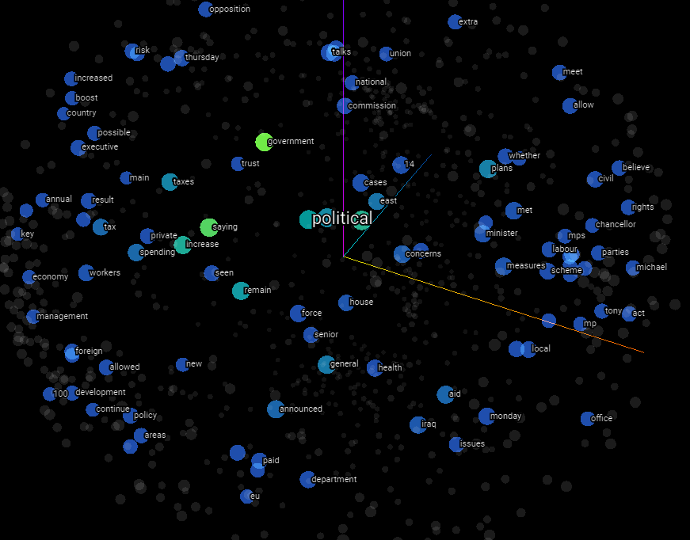
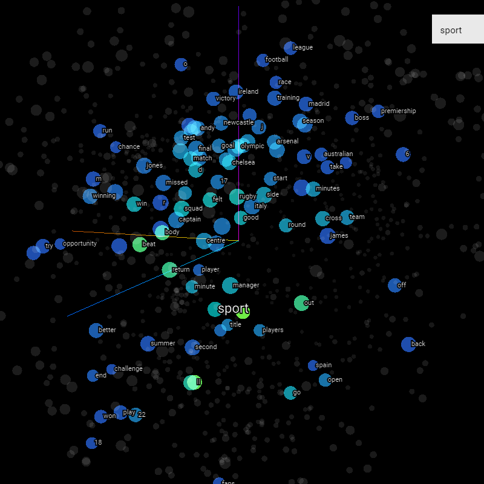

# BBC-News-Archive

## ALL THE BBC NEWS ARCHIVE ARE ANALYSED IN EMBEDDING PROJECTOR 
Public dataset from the BBC comprised of 2225 articles, each labeled under one of 5 categories: business, entertainment, politics, sport or tech.
The dataset is broken into 1490 records for training and 735 for testing. The goal will be to build a system that can accurately classify previously unseen news articles into the right category.
The competition is evaluated using Accuracy as a metric.

    

## FEW OF THE LABELS ARE SHOWN BELOW
### Political Embedding Projector

    

### Sports Embedding Projector

    

